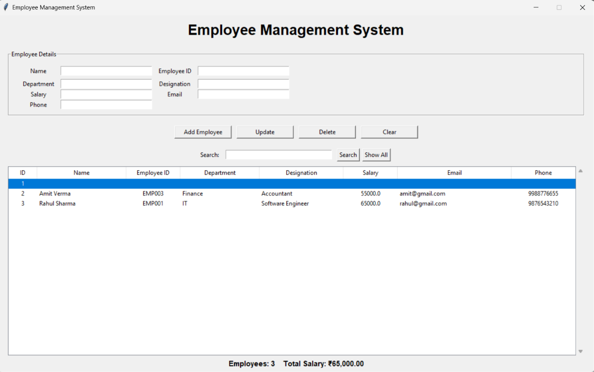
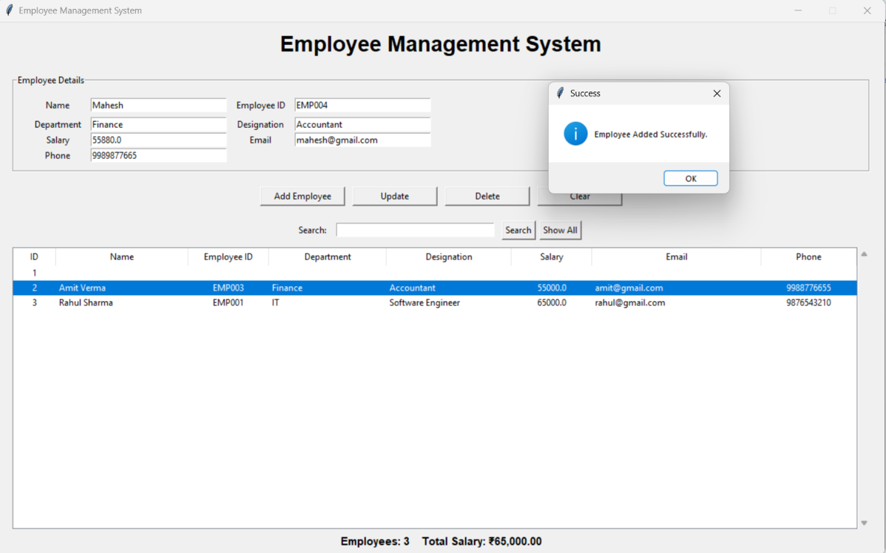
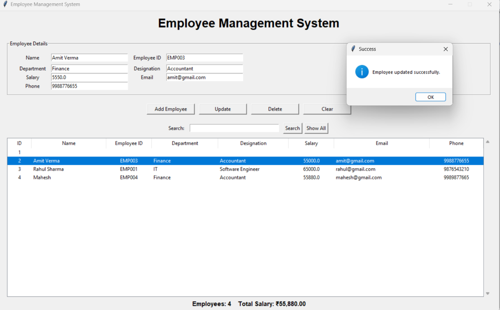
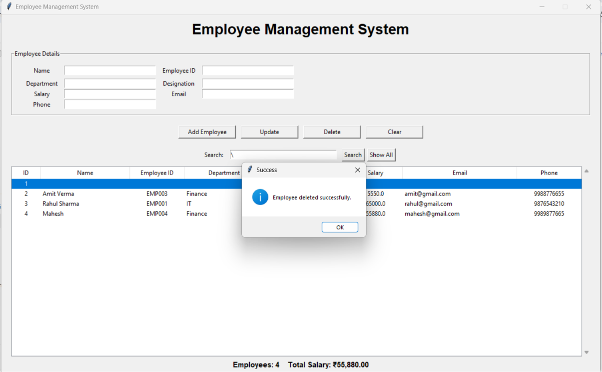
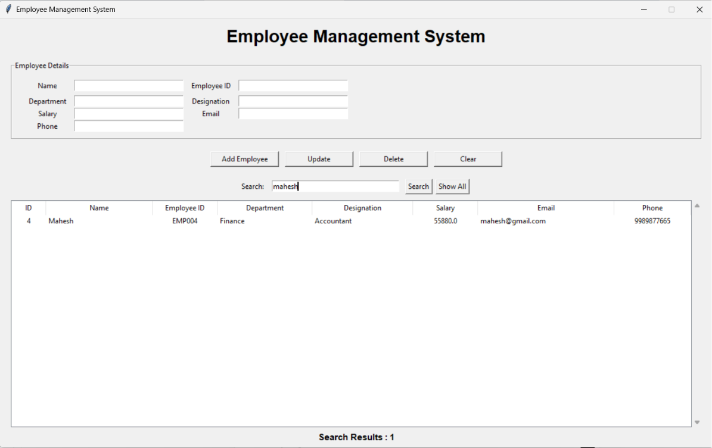
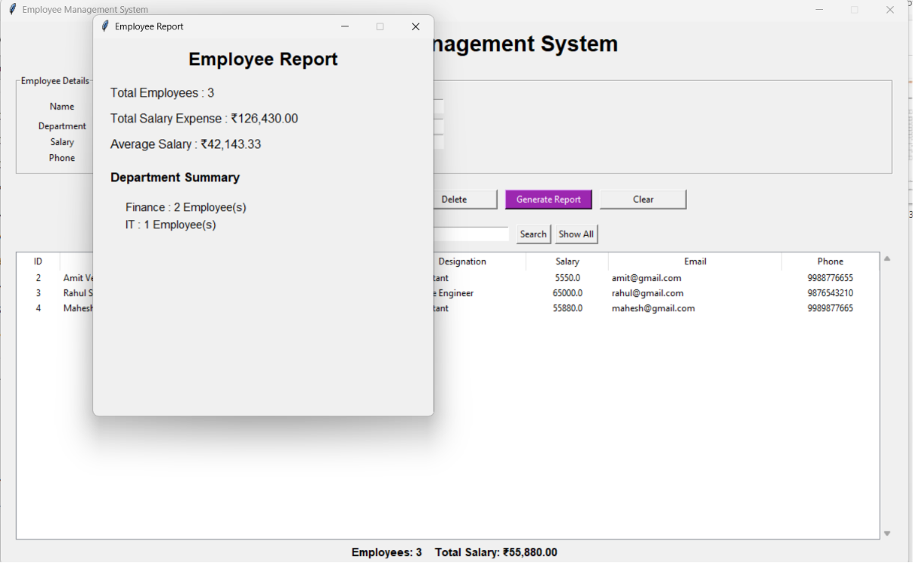

<<<<<<< HEAD
# Employee Management System

A desktop-based Employee Management System developed using Python Tkinter and SQLite.

This application helps manage employee records with CRUD operations, searching, and reporting features.

---

## Features

### Employee Management
- Add new employees
- View employee records
- Update employee details
- Delete employee records

### Search
- Search employees by:
  - Name
  - Employee ID
  - Department

### Reports
- Total employee count
- Total salary expense
- Department-wise employee summary

### Validation
- Prevent duplicate Employee IDs
- Validate required fields
- Numeric salary handling

---

## Technologies Used

| Technology | Purpose |
|---|---|
| Python | Application Logic |
| Tkinter | GUI Development |
| SQLite | Database |
| Git/GitHub | Version Control |

---

## Project Structure
Employee_Management_System/

├── database/
│ └── employee.db

├── screenshots/

├── src/
│ ├── database.py
│ ├── gui.py
│ └── main.py

├── README.md
└── requirements.txt


---

# Screenshots

## Dashboard



## Add Employee



## Update Employee



## Delete Employee



## Search Employee



## Reports



---

# Installation

Clone the repository:

```bash
git clone <repository-url>

cd Employee_Management_System


---

## Step 4: Check Git status

Run:

```powershell
git status
=======
# Employee_Management_System
>>>>>>> 7e6f2a0c01bf4f91d89d911e6311ec9eb65902e8
